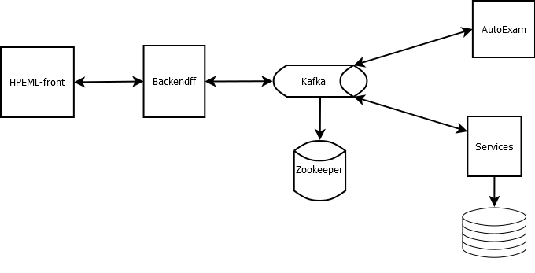

# Fetal Health in Production
Trabalho da disciplina de DevOps do núcleo de Engenharia de Machine Learning do curso de MBA em Machine Learning in Production

### Tarefa
Adicionar um modelo de ML em produção.

## Execução

1. build do angular em produção. Exemplo:

```console
ng build --prod
```

2. Enviar para o docker:

```console
docker-compose up -d
```

## Arquitetura



### HPEML-Front

É o front-end feito em Angular, é a interface com o usuário.

### Backendff (Back-end from Front)

É uma aplicação usando Python/FastAPI, é um microsserviço que lida com a entrada e saída dos dados com o front-end.

### Services

É uma aplicação em Python, um microsserviço que lida com o controle dos dados e armazenamento (o armazenamento não foi implementado ainda).

### AutoExam

É um microsserviço feito em Python que armazena o modelo de ML e realiza a classificação dos dados.

## Tecnologias

### Angular

:ballot_box_with_check: O Angular foi escolhido porque o hospital fictício cliente é um hospital de grande porte e precisa de uma aplicação que cresça de acordo.

:ballot_box_with_check: Além disso, escolheu-se a versão mais recente, até a data que o projeto foi iniciado, para implementação da aplicação pois seu suporte será mais longo.

:arrow_forward: Por se tratar de um trabalho acadêmico com poucos dias para ser feito, o Angular foi trabalhoso, além disso, escolher a versão mais recente tornou alguns códigos não compatíveis com a versão 8 (versão que tenho mais domínio).

### FastAPI

Escolheu-se o Python como linguagem principal para se manter o padrão de desenvolvimento.

FastAPI foi escolhida por, entre as 3 frameworks restful mais conhecidas do Python, ser a mais performática, conforme artigo citado na seção de fontes.

:arrow_forward: Lidar com uma framework nova aumentou a carga de trabalho, contudo, o FastAPI tem muita semelhança com o Flask, o que facilitou o desenvolvimento.

### Kafka

É o serviço de mensageria da aplicação, responsável, também, por fazer o balanceamento de carga, os serviços com maior demanda de processamento poderão ser duplicados e sua carga dividida.


## Fontes
### Fonte de Dados
<https://www.kaggle.com/datasets/andrewmvd/fetal-health-classification>
### Notebook usado para gerar modelo para produção
<https://www.kaggle.com/code/karnikakapoor/fetal-health-classification>
### FastAPI
<https://ahmed-nafies.medium.com/why-did-we-choose-fast-api-over-flask-and-django-for-our-restful-micro-services-77589534c036>